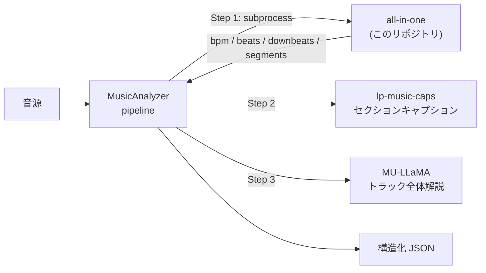

# 00. このリポジトリは何か — 全体像・動機・方向性

> このドキュメントは「**このリポジトリが何をするもので、どういうものか**」を一読で掴むための入口。
> 各機能の詳細は末尾の[ドキュメント地図](#10-ドキュメント地図)から辿れる。

---

## 1. これは何か

[mir-aidj/all-in-one](https://github.com/mir-aidj/all-in-one)（**All-In-One Music Structure Analyzer**）の
フォーク。楽曲音源から以下を推定する Python パッケージ。

- **BPM（テンポ）**
- **beats / downbeats**（拍・小節頭の時刻）
- **beat_positions**（拍番号）
- **segments**（intro / verse / chorus / bridge / outro などの機能的セクション）

CLI `allin1` と Python API `allin1.analyze()` の両方を提供する（基本的な使い方は
ルートの [README.md](../README.md) を参照）。本フォークはこの土台に独自拡張を重ねている。

---

## 2. 作った動機

1. **自分の楽曲分析ツールが欲しい** — 再生中にコード進行・セクション・BPM を見られる、手元で使えるツール
2. **解析精度の研究・改善** — 特に BPM 検出を人手ラベルに近づける
3. **AMD GPU（ROCm）で動かす** — 手元の AMD 環境で ML 音楽解析を完走させる

---

## 3. 位置づけ — MusicAnalyzer のバックエンド

このパッケージは単体ツールであると同時に、**上位アプリ MusicAnalyzer から呼ばれるバックエンド**
でもある。MusicAnalyzer は LLM 音楽理解データセットを生成するパイプラインで、
all-in-one・lp-music-caps・MU-LLaMA を統合して 1 曲から構造化 JSON を出力する。



MusicAnalyzer は `uv run --project all-in-one` で本パッケージを**別 venv の subprocess**として呼び、
`{bpm, beats, downbeats, segments}` を受け取る（`wrappers/allin1_wrapper.py`）。
そのため依存衝突なく統合でき、本リポジトリ側はバックエンドとして安定して呼べることが求められる。

---

## 4. upstream からの主な拡張

| 機能 | 概要 | 主担当ファイル | 詳細 |
|---|---|---|---|
| **コード（和音）検出** | stem 重み付き投票 + downbeat 優先スナップで安定したコード列を出力（`--chords`） | [`chord_detection.py`](../src/allin1/chord_detection.py), [`typings.py`](../src/allin1/typings.py) | [02](02_chord_detection.md) |
| **BPM アルゴリズム改善** | beat / tempogram / section / downbeat の 4 ソース融合（`--without-beats`） | [`postprocessing/`](../src/allin1/postprocessing/), [`helpers.py`](../src/allin1/helpers.py) | [01](01_bpm_algorithm.md) |
| **ROCm / AMD GPU 対応** | 数値カーネルバグ群の回避パッチ。MPS フォールバックも追加 | [`rocm_patch.py`](../src/allin1/rocm_patch.py) | [03](03_rocm_support.md) |

### 対応環境マトリクス（配布前提）

本フォークは **1 つのコードベースで 4 環境すべてに対応**する設計。デバイスは
[`analyze.py`](../src/allin1/analyze.py) / [`cli.py`](../src/allin1/cli.py) / [`models/loaders.py`](../src/allin1/models/loaders.py)
で `cuda → mps → cpu` の順に自動判別される。

| 環境 | 対応 | 仕組み | 備考 |
|---|---|---|---|
| **NVIDIA CUDA** | ✅ | fp16 autocast でそのまま動作 | upstream 標準経路 |
| **AMD ROCm / HIP** | ✅ | `is_rocm()` 時のみ [`apply_rocm_patches()`](../src/allin1/rocm_patch.py) が壊れたカーネルを fp32 化 / CPU 退避 | torch 内部では `'cuda'` 扱い → [03](03_rocm_support.md) |
| **Apple Silicon (MPS)** | ✅ | `mps` を自動選択。demucs STFT/iSTFT は MPS が複素数非対応のため当該演算のみ CPU 退避（demucs #435/#432） | Mac 以外では死にブランチ（無害） |
| **CPU のみ** | ✅ | `enabled=(device_type != 'cpu')` で autocast を無効化し fp32 実行 | GPU 不在の配布先でも動作 |

> 各環境向けの分岐は「その環境でのみ作用し、他環境では no-op / 死にブランチ」になるよう
> ガードされている（`is_rocm()`・`mps.is_available()`・`device_type != 'cpu'`）。
> **対応環境を狭めないため、これらの分岐は削除しないこと。**

---

## 5. 代表機能の思想（ハイライト）

このソフトを特徴づける「すごい所」を一言で。

- **コード検出の stem 重み付き投票** — Demucs 分離音源（bass / other / vocals）に
  個別にコード認識をかけ、**bass はルート音のみ**で投票するなど、和声理論に沿った役割分担で
  ノイズに強い判定を行う → [02](02_chord_detection.md#2-stem-分離を活かした重み付き投票核心の工夫)
- **BPM の 4 ソース融合** — 単一推定の弱点（量子化誤差・テンポ揺れ・多テンポ曲）を、
  性質の異なる 4 ソースで互いに補正。18 曲で exact 13/18 → [01](01_bpm_algorithm.md)
- **downbeat 優先 2 段階スナップ** — 「コードチェンジは小節頭で起きる」という音楽理論を、
  半径制限付きの強制スナップで実装 → [02](02_chord_detection.md#4-downbeat-を最優先する-2-段階スナップ)
- **ROCm 数値バグ群の回避** — 壊れた GPU カーネルだけを fp32 化 / CPU 退避して精度を保つ → [03](03_rocm_support.md)

---

## 6. 設計の変遷

当初は小節単位の「**キー（調性）検出**」モジュール（`key_detection/` パッケージ、librosa + music21 で
ミキサー → 和音検出 → キー推定 → 小節アライメント → セグメント集約）を設計していた（[archive/](archive/) 参照）。

その後、その中核思想 ——「**ボーカル/ドラムを除いた和声 stem を使う**」「**downbeat = 小節境界で
整合させる**」—— を引き継ぎつつ、実装は madmom ベースの単一 [`chord_detection.py`](../src/allin1/chord_detection.py)
による「**コード検出**」へ発展した。

> ⚠️ **現行はコード検出であり、キー（調性）推定は未実装**。
> 旧設計は否定された残骸ではなく、現行思想の「源流」として archive/ に保存している。

---

## 7. 今後の方向性

- **精度の追い込み** — BPM の NG ケース（多テンポ曲・量子化限界）解消、コード検出の品質向上
- **再生同期 UI アプリ** — コード帯・セクション帯をタイムラインに重ね、再生位置に追従して
  現在のコードを表示するデモ UI（構想は [plan/今回のスコープ外.md](../plan/今回のスコープ外.md)）

---

## 8. リポジトリ構成マップ

```
all-in-one/
├── src/allin1/
│   ├── analyze.py            # 解析エントリ（ROCm パッチ適用もここ）
│   ├── cli.py                # CLI（--chords / --without-beats など拡張フラグ）
│   ├── demix.py / demucs_runner.py  # Demucs 音源分離
│   ├── chord_detection.py    # ★ コード検出（stem 投票 + スナップ）
│   ├── postprocessing/       # ★ BPM アルゴリズム（tempo_estimation.py / tempo.py ほか）
│   ├── helpers.py            # 推論統括・BPM 融合・結果保存
│   ├── rocm_patch.py         # ★ ROCm / AMD GPU バグ回避パッチ
│   ├── typings.py            # AnalysisResult / Segment / ChordSegment
│   ├── models/               # モデル定義・ロード（NATTEN 置換含む）
│   └── training/             # 学習コード（upstream 由来）
├── compare_bpm.py            # 人手 BPM との照合スクリプト
├── music_ml/                 # ⚠️ 実験コード（下記参照）
├── docs/                     # 本ドキュメント群
└── plan/                     # 設計メモ（UI 構想など）
```

> 「ROCm対応記録」は本リポジトリの一部ではなく、**プロジェクト横断で使える独立した汎用ナレッジ
> リポジトリ**。ROCm パッチの原理はそちらに委譲している（[03](03_rocm_support.md) 参照）。

---

## 9. `music_ml/` の状態（要判断）

`music_ml/` は「セクション検出 + 感情分析」の独自 ML エンジン試作（自己教師あり学習・
特徴パイプライン・独自テンポ推定）だが、**現状 allin1 本体から一切 import されておらず、
解析パイプラインには未接続**の実験コードである。

- BPM 実装の**正本は [`postprocessing/`](../src/allin1/postprocessing/) 側**。
  `music_ml/tempo_estimation.py` は別系統（混同しないこと）。
- **保持 / 削除 / 本体への統合は要判断**。現時点では本ドキュメント群の対象外とする。

---

## 10. ドキュメント地図

| ドキュメント | 内容 |
|---|---|
| [00_overview.md](00_overview.md) | （本書）全体像・動機・方向性 |
| [01_bpm_algorithm.md](01_bpm_algorithm.md) | BPM アルゴリズムの設計と思想（4 ソース融合・18 曲検証） |
| [02_chord_detection.md](02_chord_detection.md) | コード検出の設計と思想（stem 投票・downbeat スナップ） |
| [03_rocm_support.md](03_rocm_support.md) | ROCm / AMD GPU 対応と MPS フォールバック |
| [04_chord_evaluation.md](04_chord_evaluation.md) | コード精度の評価基盤（`compare_chords.py`・誤り3クラスの計測） |
| [archive/](archive/) | 初期のキー（調性）検出設計（現行思想の源流・歴史記録） |
| [../README.md](../README.md) | upstream 由来の基本的な使い方・API リファレンス |
