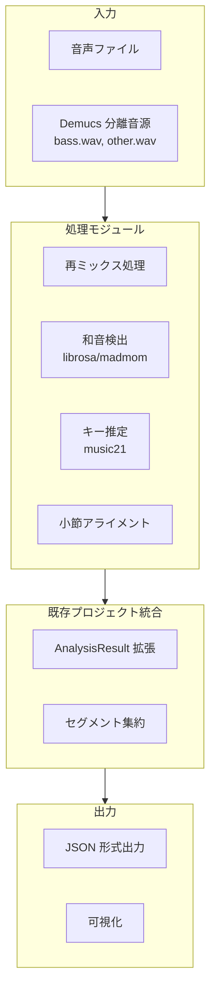
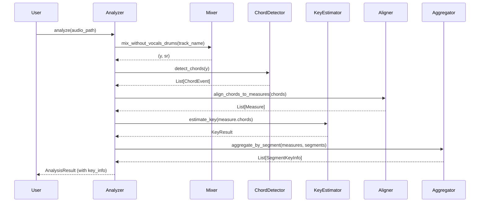

> 📜 **これは現行実装の源流となった初期設計です（歴史記録）。**
> 当初は小節単位の「キー（調性）検出」モジュール（`key_detection/` パッケージ, librosa + music21）を構想していました。
> その中核思想（和声 stem の活用・downbeat = 小節境界での整合）は、現行の madmom ベース「コード検出」
> （stem 重み付き投票 + downbeat 優先スナップ）へと発展しています。
> **現行はコード検出であり、キー（調性）推定は未実装**です。現行の設計と思想は
> [`../02_chord_detection.md`](../02_chord_detection.md) を参照してください。

---

# 小節単位キー検出モジュール - システム設計書

## 1. アーキテクチャ概要

### 1.1 システム構成図



### 1.2 モジュール構成

```
src/allin1/
├── key_detection/          # 新規追加ディレクトリ
│   ├── __init__.py         # パッケージエクスポート
│   ├── mixer.py            # Demucs 音源の再ミックス処理
│   ├── chord_detector.py   # 和音検出モジュール
│   ├── key_estimator.py    # キー推定モジュール
│   ├── measure_aligner.py  # 小節アライメント処理
│   └── aggregator.py       # セグメント集約処理
├── typings.py              # AnalysisResult に key_info を追加
└── analyze.py              # 既存の analyze() に key_detection を統合
```

---

## 2. コンポーネント設計

### 2.1 Mixer モジュール（[`mixer.py`](src/allin1/key_detection/mixer.py)）

#### 責務
- Demucs で分離された音源を読み込む
- `bass.wav` と `other.wav` を加算混合する
- キー分析用 WAV ファイルを出力する

#### インターフェース

```python
class AudioMixer:
    """Demucs 分離音源の再ミックス処理"""
    
    def __init__(self, demix_dir: Path):
        """
        Parameters
        ----------
        demix_dir : Path
            Demucs 出力ディレクトリ（例：./demix/htdemucs）
        """
        pass
    
    def mix_without_vocals_drums(self, track_name: str) -> Tuple[np.ndarray, int]:
        """
        ボーカル・ドラムを除いた音源をミックスする
        
        Returns
        -------
        Tuple[np.ndarray, int]
            (波形データ，サンプリングレート)
        """
        pass
    
    def save_mixed_audio(self, y: np.ndarray, sr: int, output_path: Path) -> None:
        """
        ミックスした音源を保存する
        
        Parameters
        ----------
        y : np.ndarray
            波形データ
        sr : int
            サンプリングレート
        output_path : Path
            出力先パス
        """
        pass
```

---

### 2.2 ChordDetector モジュール（[`chord_detector.py`](src/allin1/key_detection/chord_detector.py)）

#### 責務
- librosa または madmom を使用して和音シーケンスを検出する
- 検出した和音を時間軸付きで返す

#### インターフェース

```python
class ChordDetector:
    """和音検出モジュール"""
    
    def __init__(self, method: str = 'librosa', sr: int = 44100):
        """
        Parameters
        ----------
        method : str
            検出手法（'librosa' または 'madmom'）
        sr : int
            サンプリングレート
        """
        pass
    
    def detect_chords(self, y: np.ndarray) -> List[ChordEvent]:
        """
        和音シーケンスを検出する
        
        Parameters
        ----------
        y : np.ndarray
            波形データ
        
        Returns
        -------
        List[ChordEvent]
            検出した和音イベントのリスト
        """
        pass


@dataclass
class ChordEvent:
    """和音イベント"""
    time: float      # 発音時刻（秒）
    chord: str       # 和音ラベル（例：'C', 'Am', 'G7'）
    confidence: float  # 検出信頼度（0.0～1.0）
```

---

### 2.3 KeyEstimator モジュール（[`key_estimator.py`](src/allin1/key_detection/key_estimator.py)）

#### 責務
- 和音シーケンスからキーを推定する
- music21 を使用して調性解析を行う

#### インターフェース

```python
class KeyEstimator:
    """キー推定モジュール"""
    
    def estimate_key(self, chords: List[ChordEvent]) -> KeyResult:
        """
        和音シーケンスからキーを推定する
        
        Parameters
        ----------
        chords : List[ChordEvent]
            和音イベントのリスト
        
        Returns
        -------
        KeyResult
            キー推定結果
        """
        pass


@dataclass
class KeyResult:
    """キー推定結果"""
    key: str           # キー（例：'C major', 'A minor'）
    confidence: float  # 推定信頼度（0.0～1.0）
    tonic: str         # トニック音（例：'C'）
    mode: str          # モード（'major' または 'minor'）
```

---

### 2.4 MeasureAligner モジュール（[`measure_aligner.py`](src/allin1/key_detection/measure_aligner.py)）

#### 責務
- ダウンビート情報に基づき、和音イベントを小節にアライメントする
- 各小節の開始・終了時刻を計算する

#### インターフェース

```python
class MeasureAligner:
    """小節アライメント処理"""
    
    def __init__(self, downbeats: List[float]):
        """
        Parameters
        ----------
        downbeats : List[float]
            ダウンビート時刻のリスト（秒）
        """
        pass
    
    def align_chords_to_measures(self, chords: List[ChordEvent]) -> List[Measure]:
        """
        和音イベントを小節にアライメントする
        
        Parameters
        ----------
        chords : List[ChordEvent]
            和音イベントのリスト
        
        Returns
        -------
        List[Measure]
            アライメントされた小節のリスト
        """
        pass


@dataclass
class Measure:
    """小節情報"""
    start: float           # 開始時刻（秒）
    end: float             # 終了時刻（秒）
    chords: List[ChordEvent]  # 含まれる和音イベント
    key_result: Optional[KeyResult] = None  # キー推定結果（後で設定）
```

---

### 2.5 Aggregator モジュール（[`aggregator.py`](src/allin1/key_detection/aggregator.py)）

#### 責務
- セグメントごとに小節のキーを集約する
- セグメントごとの代表キーを決定する

#### インターフェース

```python
class KeyAggregator:
    """セグメント集約処理"""
    
    def aggregate_by_segment(
        self, 
        measures: List[Measure], 
        segments: List[Segment]
    ) -> List[SegmentKeyInfo]:
        """
        セグメントごとにキーを集約する
        
        Parameters
        ----------
        measures : List[Measure]
            小節のリスト
        segments : List[Segment]
            セグメントのリスト
        
        Returns
        -------
        List[SegmentKeyInfo]
            セグメントごとのキー情報
        """
        pass


@dataclass
class SegmentKeyInfo(Segment):
    """セグメントとキー情報の組み合わせ"""
    key: str           # 代表キー
    confidence: float  # 推定信頼度
    measure_count: int  # 含まれる小節数
```

---

## 3. データフロー

### 3.1 主要なデータフロー



---

## 4. データ構造拡張

### 4.1 [`AnalysisResult`](src/allin1/typings.py:32) の拡張

既存のデータクラスに `key_info` フィールドを追加：

```python
@dataclass
class AnalysisResult:
    path: Path
    bpm: int
    beats: List[float]
    downbeats: List[float]
    beat_positions: List[int]
    segments: List[Segment]
    tempo_candidates: List[float] = field(default_factory=list)
    activations: Optional[Dict[str, NDArray]] = None
    embeddings: Optional[NDArray] = None
    
    # 新規追加
    key_info: Optional[List[SegmentKeyInfo]] = None
```

---

## 5. エラーハンドリング

### 5.1 例外定義

```python
class KeyDetectionError(Exception):
    """キー検出モジュールの基底例外"""
    pass


class AudioLoadError(KeyDetectionError):
    """音源読み込みエラー"""
    pass


class ChordDetectionError(KeyDetectionError):
    """和音検出エラー"""
    pass


class KeyEstimationError(KeyDetectionError):
    """キー推定エラー"""
    pass
```

### 5.2 エラー処理方針

| エラータイプ | 対処法 |
|-----------|--------|
| Demucs 音源が見つからない | 既存の `demix()` 関数で再実行を促す |
| 和音検出失敗 | デフォルトキー（'unknown'）を設定し、警告を出力 |
| キー推定失敗 | セグメントのキーを前セグメントから継承 |

---

## 6. パフォーマンス最適化

### 6.1 並列処理

- 複数曲を分析する場合、[`multiprocessing.Pool`](src/allin1/sonify.py:28) を使用して並列処理
- 各小節のキー推定を独立して実行可能

### 6.2 キャッシュ戦略

| キャッシュ対象 | キー | 保存形式 |
|---------------|------|---------|
| ミックス音源 | `{track_name}_mixed.wav` | WAV |
| 和音シーケンス | `{track_name}_chords.json` | JSON |
| キー推定結果 | `{track_name}_key.json` | JSON |

---

## 7. 依存関係

### 7.1 Python パッケージ

```toml
# pyproject.toml に追加
[project.optional-dependencies]
key-detection = [
    "librosa>=0.10.0",
    "madmom>=0.4.0",
    "music21>=8.0.0",
]
```

### 7.2 既存ライブラリとの統合

| ライブラリ | 用途 | 統合方法 |
|-----------|------|---------|
| `librosa` | 音声分析 | [`sonify.py`](src/allin1/sonify.py:4) と共通 |
| `demucs` | 音源分離 | [`demix.py`](src/allin1/demix.py:5) を再利用 |

---

## 8. 実装優先順位

| ステージ | モジュール | 期間 |
|---------|-----------|------|
| Stage 1 | `mixer.py` | 1 日 |
| Stage 2 | `chord_detector.py` | 2 日 |
| Stage 3 | `key_estimator.py` | 2 日 |
| Stage 4 | `measure_aligner.py`, `aggregator.py` | 1 日 |
| Stage 5 | [`typings.py`](src/allin1/typings.py) 拡張，[`analyze.py`](src/allin1/analyze.py) 統合 | 1 日 |

---

## 9. 参照ドキュメント

- [`01_requirements.md`](docs/01_requirements.md) - 要件定義書
- [`AnalysisResult`](src/allin1/typings.py:32) - 既存の分析結果データ構造
- [`analyze()`](src/allin1/analyze.py:22) - 主要な分析関数
